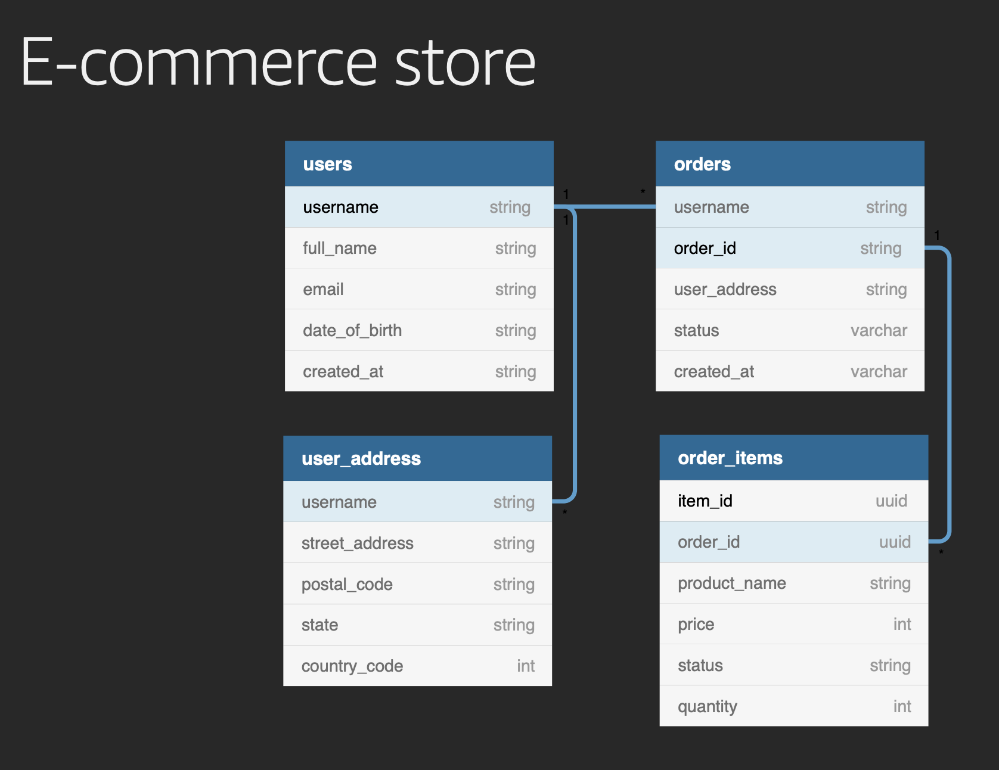

# Reference Architecture: DDB Single-Table Design

This set of data models comes from Alex DeBrie's [2019 re:Invent talk](https://youtu.be/DIQVJqiSUkE) "Data modeling with Amazon DynamoDB (CMY304)"

## To Deploy and Run
First, do what need to have CLI access to your AWS account (you can quickly verify this with `aws s3 ls` or similar). The serverless file does nothing else but create the DynamoDB table.

`$ npm ci`

`$ npx sls deploy`

`$ npm run test:int`

## E-Commerce Store
Alex describes some data access patterns in his talk that I've listed below, with one minor modification. Pattern #3 originally was "Get single order and order items" and I have modified it to "Get all order items for an order". This keeps data access in line with a REST or GraphQL framework, which is 99% of my building experience.

### Access Patterns
1. Get a user profile
2. Get an order
3. Get orders for user
4. Get order items for order
5. Get orders for user by status
6. Get (first few) open orders

### ERD

### Entity Chart
Below is how each primary key is mapped for each entity:

||PK|SK|GSI1PK|GSI1SK|GSI2PK|GSI2SK|GSI3PK|
|---|---|---|---|---|---|---|---|
|User|USER#\<username\>| #PROFILE#\<username\>|
|User Address|N/A|N/A|
|Order|USER#\<username\>|ORDER#\<orderId\>|SK|PK|PK|\<status\>#\<createdAt\>|\<random_hash\>
|Order Item|ITEM#\<itemId\>|ORDER#\<orderId\>|SK|PK|

### Access Pattern Solved
||Access Pattern|Query Conditions|
|---|---|---|
|1|Get user profile|GET PK = USER#\<username\> AND SK = #PROFILE#\<username\>|
|2|Get order by id|QUERY GSI1PK = ORDER#\<orderId\> AND GSI1SK BeginsWith(USER#)|
|3|Get orders for user|QUERY PK = USER#\<username\> AND SK BeginsWith(ORDER#)|
|4|Get order items for order|QUERY GSI1PK = ORDER#\<orderId\> AND SK BeginsWith(ITEM#)|
|5|Get orders for user by status (e.g., 'SHIPPED')|QUERY GSI2PK = USER#\<username\> AND GSI2SK BeginsWith('SHIPPED#')|
|6|Get top 3 open orders|SCAN GSI3PK|

### Architecture
This project models how to implement single-table-design patterns. As such, it needs nothing higher than a Repository layer. The repo pulls in models defined in a separate file. The models file is mostly key schema mapping for [dynamodb-toolbox](https://github.com/jeremydaly/dynamodb-toolbox) so it can do the heavy lifting for us.
